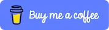
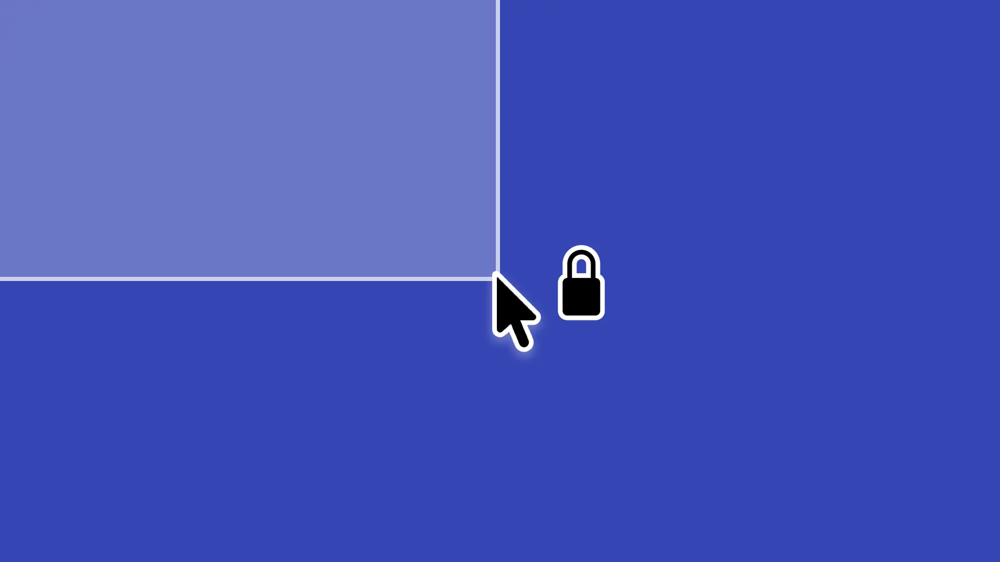
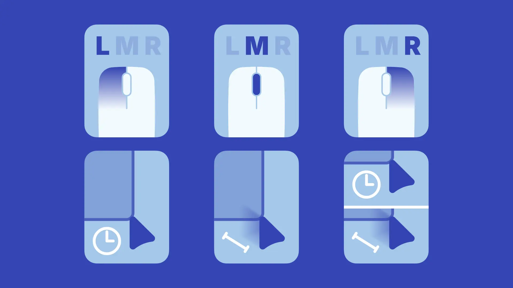
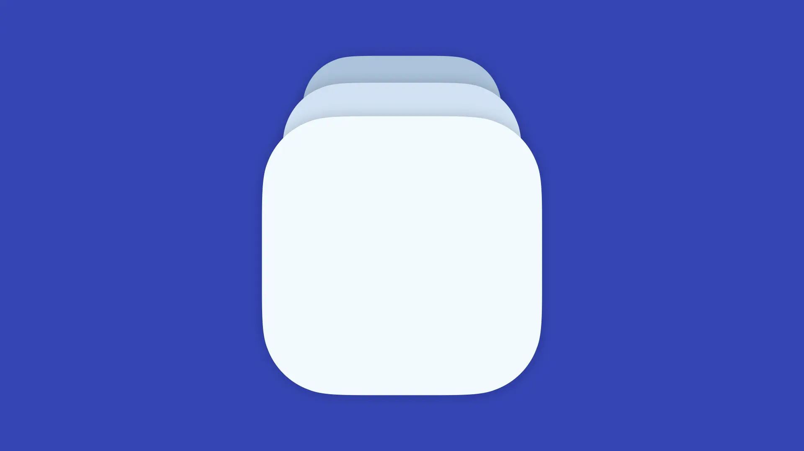

# DragLocker
**English** | [日本語](docs/README-ja.md)

  
  &nbsp;
  
  &nbsp;
  

  

## Table of Contents
- [About DragLocker](#about-draglocker)
  - [Download](#download)
  - [System Requirements](#system-requirements)
  - [Differences Between Free and Paid Versions](#differences-between-free-and-paid-versions)
- [What You Can Do with DragLocker](#what-you-can-do-with-draglocker)
  - [Customize Buttons and Methods](#customize-buttons-and-methods)
  - [Show Icon While Locked](#show-icon-while-locked)
  - [Customize Behavior per App](#customize-behavior-per-app)
- [Support and Feedback](#support-and-feedback)
  - [Bug Reports](#bug-reports)
  - [Feedback](#feedback)
  - [Community](#community)
- [Support the Developer](#support-the-developer)
  - [Star the Repository](#star-the-repository)
  - [Donate](#donate)
- [Credits](#credits)
  - [Antigravity and Gemini CLI by Google](#antigravity-and-gemini-cli-by-google)
  - [KeyboardShortcuts by Sindre Sorhus](#keyboardshortcuts-by-sindre-sorhus)

## About DragLocker

Windows has a Click lock (drag lock) feature that keeps the drag state even after you release the mouse button. However, have you ever felt it inconvenient that macOS doesn't have this feature except for the trackpad?\
Use DragLocker to enable drag lock with any mouse connected to your Mac.

### Download

You can download DragLocker for free from the [**Releases page**](https://github.com/taikun114/DragLocker/releases/latest) or purchase it for $2.99 on the [**Mac App Store**](https://apps.apple.com/us/app/リンクが確定次第).

> [!NOTE]
> Prices may vary by region. The price is based on 500 JPY, so it may change automatically due to fluctuations in foreign exchange rates.

  
  &nbsp;
  

### System Requirements

To run DragLocker, **macOS Sonoma (14.0) or later** is required. It supports both **Mac with an Intel processor** and **Mac with Apple silicon**.

### Differences Between Free and Paid Versions

DragLocker is available in a free version (GitHub version) and a paid version (App Store version), but there are no differences in the main features of the app.\
The App Store version includes features provided by the App Store, such as automatic updates, and very minor platform-specific features like review requests.

The differences are as follows:

| Feature               | Free Version (GitHub) | Paid Version (App Store)    |
|-----------------------|-----------------------|-----------------------------|
| Price                 | Free                  | $2.99                       |
| All App Features      | ○                     | ○                           |
| Automatic Updates     | ×                     | ○ (App Store Feature)       |
| Review Requests       | ×                     | ○ (Can be disabled)         |
| Support the Developer | ○ (via Donation)      | ○ (via Purchase & Donation) |

Please see the [`app-store-version`](https://github.com/taikun114/DragLocker/tree/app-store-version) branch for the source code of the App Store version.

I would appreciate it if you purchase it from the App Store to support me, but please feel free to download it for free first. If you find it very useful, I would be extremely happy if you purchase it or [**donate**](#donate)!

## What You Can Do with DragLocker

### Customize Buttons and Methods

You can customize it to drag lock only with specific mouse buttons or choose the method to trigger the drag lock.

### Show Icon While Locked

By setting it to show the icon in the app settings, an icon will be shown near the pointer while drag lock is active, letting you know the current state at a glance.

### Customize Behavior per App

You can customize drag lock settings for each application, allowing it to work only in specific apps or to exclude specific apps.

## Support and Feedback

### Bug Reports

DragLocker was developed utilizing generative AI. While I have tested it extensively during development, bugs may still remain or some features may not function properly.

If you find any bugs or operational issues, please check the existing [**Issues**](https://github.com/taikun114/DragLocker/issues) (known bugs and issues) to see if someone else has already reported the same problem. If you cannot find the same issue, please open a new issue and report it.\
To make bug tracking easier, if you want to report multiple issues, please open one issue per problem. In other words, if you want to report two bugs, you need to open two separate issues.

### Feedback

If you do not have a GitHub account and would like to send feedback, such as bug reports, feature ideas, or messages to the developer (me), you can email me by clicking [**this link**](mailto:contact.taikun@gmail.com?subject=DragLocker%20Feedback:%20&amp;body=Please%20describe%20your%20feedback%20in%20detail:%0D%0A%0D%0A%0D%0ASystem%20Information:%0D%0A%0D%0A-%20System%20%0D%0APlease%20enter%20your%20Mac%20model.%0D%0A%0D%0A%0D%0A-%20macOS%20Version%20%0D%0AIf%20you%20are%20experiencing%20problems,%20please%20enter%20the%20macOS%20version.%0D%0A%0D%0A%0D%0A-%20App%20Version%0D%0AIf%20you%20are%20experiencing%20problems,%20please%20enter%20the%20app%20version.%0D%0A%0D%0A) or via the "Send Feedback" button in the "Information" tab of the app settings (please note that I may not be able to reply to all messages).\
Opening the email draft from the button inside the app will pre-fill necessary information such as Mac system information (model ID, CPU architecture, macOS version) and app version, so sending it from there is highly recommended.

### Community

There is a [**Discussions page**](https://github.com/taikun114/DragLocker/discussions) where you can share new features you want added to the app, ask questions about issues you're not sure are bugs, and exchange opinions with others.\
Please use it as a place to exchange information. I check it often, so messages to the developer are also very welcome!

## Support the Developer

### Star the Repository

It would make me very happy if you open [**this page**](https://github.com/taikun114/DragLocker) and click the "Star" button in the top right to give it a star!\
This button is like an upvote button and serves as motivation to continue development! This is completely free, so if you like DragLocker, please give it a star!

### Donate

If you like DragLocker, I would be happy if you support me with a donation. It motivates me to keep developing!

You can support me using the following services.

#### Buy Me a Coffee

You can support me on [**Buy Me a Coffee**](https://www.buymeacoffee.com/i_am_taikun) for the price of a cup of green tea.

#### PayPal\.Me

If you have a PayPal account, you can also donate directly via [**PayPal**](https://paypal.me/taikun114).

## Credits

### [Antigravity](https://antigravity.google/) and [Gemini CLI](https://github.com/google-gemini/gemini-cli) by Google

These wonderful generative AI tools were used in the development of DragLocker. As a person with a physical disability that makes keyboard input difficult, I would not have been able to complete this app without the power of generative AI.

### [KeyboardShortcuts](https://github.com/sindresorhus/KeyboardShortcuts) by Sindre Sorhus

The KeyboardShortcuts package was used to implement global shortcut keys in DragLocker. Thanks to this package, I was able to implement the shortcut functionality extremely smoothly.
