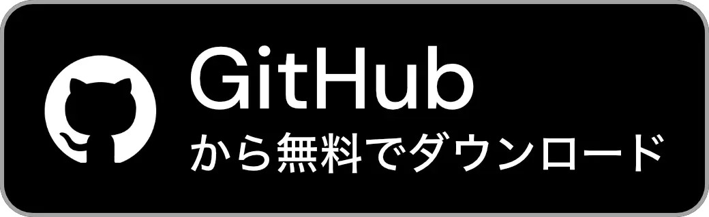

# DragLocker
[English](../README.md) | **日本語**

  
  &nbsp;
  
  &nbsp;
  

  

## 目次
- [DragLockerについて](#draglockerについて)
  - [ダウンロード](#ダウンロード)
  - [システム要件](#システム要件)
  - [無料版と有料版の違い](#無料版と有料版の違い)
- [DragLockerでできること](#draglockerでできること)
  - [ボタンと方法をカスタマイズ](#ボタンと方法をカスタマイズ)
  - [ロック中にアイコンを表示](#ロック中にアイコンを表示)
  - [アプリごとに動作をカスタマイズ](#アプリごとに動作をカスタマイズ)
- [サポートとフィードバック](#サポートとフィードバック)
  - [バグ報告](#バグ報告)
  - [フィードバック](#フィードバック)
  - [コミュニティ](#コミュニティ)
- [開発者をサポート](#開発者をサポート)
  - [リポジトリにスターをつける](#リポジトリにスターをつける)
  - [寄付](#寄付)
- [クレジット](#クレジット)
  - [Antigravity と Gemini CLI by Google](#antigravity-と-gemini-cli-by-google)
  - [KeyboardShortcuts by Sindre Sorhus](#keyboardshortcuts-by-sindre-sorhus)

## DragLockerについて

Windowsにはマウスボタンを離してもドラッグ状態を維持することができるドラッグロック（クリックロック）機能がありますが、macOSにはトラックパッド以外でこの機能を使うことができず、不便だと思ったことはありませんか？\
DragLockerを使えば、Macに接続されたあらゆるマウスでドラッグロックできます。

### ダウンロード

DragLockerは[**リリースページ**](https://github.com/taikun114/DragLocker/releases/latest)から無料でダウンロードするか、[**Mac App Store**](https://apps.apple.com/jp/app/draglocker/id6770572129)から500円で購入することができます。

  
  &nbsp;
  

### システム要件

DragLockerを実行するには、**macOS Sonoma（14.0）またはそれ以降**が必要です。**Intelプロセッサを搭載したMac**と**Appleシリコンを搭載したMac**に対応しています。

### 無料版と有料版の違い

DragLockerには無料版（GitHub版）と有料版（App Store版）がありますが、アプリの主な機能に違いはありません。\
App Store版には、App Storeによって提供される自動アップデート機能のような機能や、レビューリクエストのようなプラットフォーム固有の機能が追加されています。

それぞれの違いについては以下の通りです。

| 機能             | 無料版 (GitHub版) | 有料版 (App Store版)  |
|-----------------|-----------------|---------------------|
| 価格             | 無料             | 500円                |
| アプリのすべての機能 | ○               | ○                   |
| 自動アップデート    | ×               | ○ (App Storeの機能)   |
| 寄付リンク         | ○               | × (App Storeの審査のため) |
| レビューリクエスト   | ×               | ○ (無効化可能)        |
| 開発者へのサポート   | ○ (寄付リンクから) | ○ (購入から)          |

App Store版のソースコードは[`app-store-version`](https://github.com/taikun114/DragLocker/tree/app-store-version)ブランチをご覧ください。

私としてはApp Storeから購入してくださるとありがたいですが、まずは無料でダウンロードしてみて、とても便利だと思ったら購入したり[**寄付**](#寄付)したりしてくださると大変嬉しいです！

## DragLockerでできること

### ボタンと方法をカスタマイズ

特定のマウスボタンでのみドラッグロックするように設定したり、ドラッグロックを開始する方法を選択したりしてカスタマイズできます。

### ロック中にアイコンを表示

アプリの設定からアイコンを表示するように設定すれば、ドラッグロックされているときにポインタ付近にアイコンが表示され、現在の状態が一目でわかります。

### アプリごとに動作をカスタマイズ

アプリごとにドラッグロックの設定をカスタマイズすることができるため、特定のアプリでのみ動作するようにしたり、特定のアプリを除外したりすることができます。

## サポートとフィードバック

### バグ報告

DragLockerは生成AIを活用して開発されたアプリです。開発中に何度もテストは行いましたが、それでもバグが残っていたり、一部機能が正常に動作しなかったりする場合があります。

バグや動作の問題を見つけた場合は、既に開かれている[**Issue**](https://github.com/taikun114/DragLocker/issues)（既知のバグや問題）を確認し、他の方が報告している同じ問題がないか探してみてください。同じ問題が見つからなかった場合は新しいIssueを開き、問題の報告をお願いします。\
バグトラッキングを容易にするため、複数の問題を報告したい場合は1つの問題に対して1つのIssueを開いてください。つまり、2つのバグを報告したい場合は2つのIssueを開く必要があります。

### フィードバック

GitHubアカウントをお持ちでない方のバグ報告やアイデア共有、開発者（私）へのメッセージなど、フィードバックを送りたい場合は[**こちらのリンク**](mailto:contact.taikun@gmail.com?subject=DragLocker%E3%81%AE%E3%83%95%E3%82%A3%E3%83%BC%E3%83%89%E3%83%90%E3%83%83%E3%82%AF%3A%20&amp;body=%E3%83%95%E3%82%A3%E3%83%BC%E3%83%89%E3%83%90%E3%83%83%E3%82%AF%E5%86%85%E5%AE%B9%E3%82%92%E5%85%B7%E4%BD%93%E7%9A%84%E3%81%AB%E8%AA%AC%E6%98%8E%E3%81%97%E3%81%A6%E3%81%8F%E3%81%A0%E3%81%95%E3%81%84%3A%0D%0A%0D%0A%0D%0A%E3%82%B7%E3%82%B9%E3%83%86%E3%83%A0%E6%83%85%E5%A0%B1%3A%0D%0A%0D%0A%E3%83%BB%E3%82%B7%E3%82%B9%E3%83%86%E3%83%A0%0D%0A%E3%81%8A%E4%BD%BF%E3%81%84%E3%81%AEMac%E3%81%AE%E6%A9%9F%E7%A8%AE%E3%82%92%E5%85%A5%E5%8A%9B%E3%81%97%E3%81%A6%E3%81%8F%E3%81%A0%E3%81%95%E3%81%84%E3%80%82%0D%0A%0D%0A%0D%0A%E3%83%BBmacOS%E3%83%90%E3%83%BC%E3%82%B8%E3%83%A7%E3%83%B3%0D%0A%E5%95%8F%E9%A1%8C%E3%81%8C%E8%B5%B7%E3%81%93%E3%81%A3%E3%81%A6%E3%81%84%E3%82%8B%E5%A0%B4%E5%90%88%E3%80%81macOS%E3%81%AE%E3%83%90%E3%83%BC%E3%82%B8%E3%83%A7%E3%83%B3%E3%82%92%E5%85%A5%E5%8A%9B%E3%81%97%E3%81%A6%E3%81%8F%E3%81%A0%E3%81%95%E3%81%84%E3%80%82%0D%0A%0D%0A%0D%0A%E3%83%BB%E3%82%A2%E3%83%97%E3%83%AA%E3%83%90%E3%83%BC%E3%82%B8%E3%83%A7%E3%83%B3%0D%0A%E5%95%8F%E9%A1%8C%E3%81%8C%E8%B5%B7%E3%81%93%E3%81%A3%E3%81%A6%E3%81%84%E3%82%8B%E5%A0%B4%E5%90%88%E3%80%81%E3%82%A2%E3%83%97%E3%83%AA%E3%81%AE%E3%83%90%E3%83%BC%E3%82%B8%E3%83%A7%E3%83%B3%E3%82%92%E5%85%A5%E5%8A%9B%E3%81%97%E3%81%A6%E3%81%8F%E3%81%A0%E3%81%95%E3%81%84%E3%80%82%0D%0A%0D%0A)をクリックするか、アプリ内設定の「情報」タブにある「フィードバックを送信」ボタンからメールをお送りいただけます（すべてのメッセージに返信できるとは限りませんので、あらかじめご了承ください）。\
アプリ内のボタンからメールの送信画面を開くと、Macのシステム情報（機種ID、CPUアーキテクチャの種類、macOSのバージョン情報）やアプリのバージョン情報など、こちら側で必要な情報が事前に入力された状態になるため、アプリから送信していただくことをおすすめします。

### コミュニティ

アプリに追加してほしい新機能の共有や、バグかどうかはわからないけど気になる問題など、質問したり他の人と意見交換したりできる[**ディスカッションページ**](https://github.com/taikun114/DragLocker/discussions)が用意されています。\
情報交換の場として、ぜひご活用ください。私もよく覗いているので、開発者へのメッセージも大歓迎です！

## 開発者をサポート
### リポジトリにスターをつける
[**こちらのページ**](https://github.com/taikun114/DragLocker)を開き、右上の「Star」ボタンをクリックしてスターをつけてくださるととても嬉しいです！\
このボタンは言わば高評価ボタンのようなもので、開発を続けるモチベーションになります！スターは無料でつけられますので、DragLockerを気に入ったらぜひスターをつけてください！

### 寄付
DragLockerが気に入ったら寄付してくださると嬉しいです。開発を続けるモチベーションになります！

以下のサービスを使って寄付していただくことができます。

#### Buy Me a Coffee
[**Buy Me a Coffee**](https://www.buymeacoffee.com/i_am_taikun)で緑茶一杯分の金額からサポートしていただけます。

#### PayPal\.Me
PayPalアカウントをお持ちの方は、[**PayPal**](https://paypal.me/taikun114)で直接寄付していただくこともできます。

## クレジット

### [Antigravity](https://antigravity.google/) と [Gemini CLI](https://github.com/google-gemini/gemini-cli) by Google
DragLockerの開発にはこれらの素晴らしい生成AIツールが使用されました。キーボードでの入力が難しい身体障害者の私にとって、生成AIの力がなければこのアプリを完成させることはできなかったでしょう。

### [KeyboardShortcuts](https://github.com/sindresorhus/KeyboardShortcuts) by Sindre Sorhus
DragLockerのグローバルショートカットキーの実装にはKeyboardShortcutsパッケージが使用されました。このパッケージのおかげで、非常にスムーズにショートカット機能を実装することができました。

